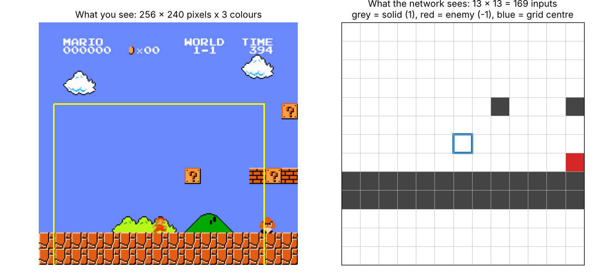

# Step 1: The environment and what the agent sees

This first step sets up the game in Python and recreates how MarI/O looks at
it. No learning happens yet; it is the foundation every algorithm in this
repo builds on.

## 1. The game: gym-super-mario-bros

[gym-super-mario-bros](https://pypi.org/project/gym-super-mario-bros/) runs
the original NES Super Mario Bros. inside a Python emulator
([nes-py](https://pypi.org/project/nes-py/)) and exposes it through the
standard [Gymnasium](https://gymnasium.farama.org/) API that most RL code
uses:

```python
obs, info = env.reset()                                   # start a level
obs, reward, terminated, truncated, info = env.step(action)  # advance one frame
```

* One `step` is one frame of the game (60 per second of game time).
* `info` carries useful facts read from the game, such as `x_pos` (how far
  right Mario is), `flag_get` (he reached the flag) and `life`.
* The ROM ships with the package, so nothing else needs downloading.
* We use `SuperMarioBros-1-1-v0` (World 1-1), the level MarI/O learned to
  beat.

We picked it over [stable-retro](https://github.com/Farama-Foundation/stable-retro)
(you supply your own ROM; better if we ever want other consoles) and
[NeSLE](https://github.com/hbofz/NeSLE) (thousands of games in parallel on a
GPU; more than NEAT needs).

### Seeing it: a random agent

```bash
python scripts/random_agent.py
```

Every frame, the agent presses one of the 7 button combos in
`SIMPLE_MOVEMENT` at random. Mario jitters around and rarely gets far. That
is the baseline: anything that learns has to do better than this.

## 2. What MarI/O sees: the input grid

By default, the observation is the screen itself: 256 x 240 pixels with 3
colour channels, **184,320 numbers** per frame. MarI/O does not use any of
them. It reads the game's memory instead and builds a **13 x 13 grid** of the
blocks around Mario:

| value | meaning |
|------:|---------|
| `1`   | a solid block (ground, brick, pipe, ? block) |
| `-1`  | an enemy (goomba, koopa, ...) |
| `0`   | empty space |



*Left: what you see; the yellow square is the area the grid covers. Right:
the 169 numbers the network receives.*

### Why so small? Because of NEAT

NEAT (NeuroEvolution of Augmenting Topologies, Stanley & Miikkulainen 2002)
evolves neural networks, starting from the simplest one possible: every
input wired straight to the outputs, no hidden neurons. It then adds neurons
and connections one mutation at a time, keeping what helps.

In NEAT **every input is a node in the network** and every connection is a
gene that evolution has to discover. With 184,320 pixel inputs, the
networks would be enormous and almost every random mutation would touch a
meaningless pixel, so evolution would crawl. With 169 inputs that already say
"wall here" or "enemy there", a few lucky connections (e.g. *enemy just ahead
→ press jump*) are enough to make progress. The grid does the "vision" so
the network only has to learn *what to do*.

Modern deep RL (PPO, DQN) can learn from pixels because convolutional
networks are good at extracting that structure by themselves, at the cost of
millions of frames of training. Having both observations in this repo lets us
compare the two approaches later.

### How the grid is built (`marrlio/inputs.py`)

The code is a line-by-line port of the Super Mario Bros. part of
[SethBling's MarI/O script](https://gist.github.com/SethBling/598639f8d5e8afb5453a0b9519be51ff):

1. **Where is Mario?** (`mario_position`, Lua `getPositions`). His level
   x-position is stored as a page number (`0x6D`) times 256 plus a pixel
   within the page (`0x86`); his y comes from `0x3B8`.
2. **Which blocks are solid?** (`is_solid`, Lua `getTile`). The game keeps
   the visible part of the level in RAM from `0x500`: two pages of 13 rows by
   16 columns of block ids. Any non-zero id counts as solid.
3. **Where are the enemies?** (`enemy_positions`, Lua `getSprites`). The game
   tracks up to 5 enemies at once; slot *i* is active when `0x0F + i` is
   non-zero, with its position in `0x6E + i`, `0x87 + i` and `0xCF + i`.
4. **Fill the grid** (`input_grid`, Lua `getInputs`). For each of the 13 x 13
   cells, 16 pixels apart and centred on Mario: `1` if the block there is
   solid, then `-1` if an enemy is within 8 pixels of the cell.

Two quirks are kept on purpose so our results stay comparable with MarI/O:

* The centre cell sits one block above small Mario's feet (on big Mario it is
  his head), so ground shows up two rows below the centre.
* At the very start of the level the leftmost columns read as empty, because
  they are before the beginning of the level.

You can watch the grid change as Mario runs:

```bash
python scripts/show_inputs.py          # game window + grid printed in the terminal
python scripts/show_inputs.py --no-render   # grid only, no display needed
```

```text
frame 100  x=300
. . . . . . . . . # . . .
. . . . . . . . . . . . .
. . . . . . . . . . . . .
. . . . . . . . . . . . .
. . . # . . . # # # # # .      <- ? blocks and bricks above
. . . . . . . . . . . . .
. . . . . . M . . . . . .      <- M = grid centre (not part of the input)
. . . . . . . E . . . . .      <- a goomba right in front
# # # # # # # # # # # # #      <- the ground
# # # # # # # # # # # # #
. . . . . . . . . . . . .      <- below the bottom of the screen
. . . . . . . . . . . . .
. . . . . . . . . . . . .
```

## 3. How MarI/O presses buttons (`marrlio/controller.py`)

The network has one output per button: **A** (jump), **B** (run), **up**,
**down**, **left** and **right**. Each output above zero means "hold this
button". So instead of choosing one combo from a menu, the agent can press
any combination. Pressing left and right together (or up and down) cancels
both, as in MarI/O.

`ButtonController` wraps the environment so its action is a list of six
0/1 values, e.g. `[1, 1, 0, 0, 0, 1]` = jump + run + right.

## 4. Putting it together (`marrlio/env.py`)

| function | observation | actions | for |
|----------|-------------|---------|-----|
| `make_env()` | screen pixels (240 x 256 x 3) | menu of combos (`SIMPLE_MOVEMENT`) | deep RL such as PPO or DQN |
| `make_marios_env()` | 13 x 13 input grid | 6 independent buttons | NEAT (MarI/O) |

```python
from marrlio.env import make_marios_env

env = make_marios_env(render_mode="human")
grid, info = env.reset()
grid, reward, terminated, truncated, info = env.step([0, 1, 0, 0, 0, 1])  # run right
```

## Next step

Implement NEAT and the MarI/O fitness function (how far right Mario gets,
minus a penalty for time) and evolve networks until one clears World 1-1.
